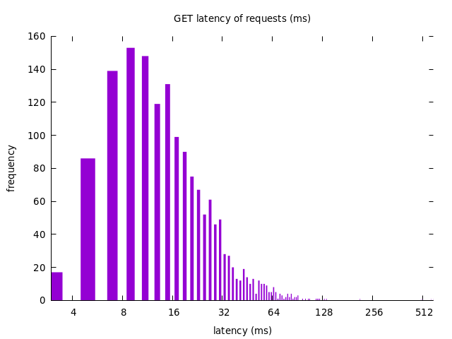
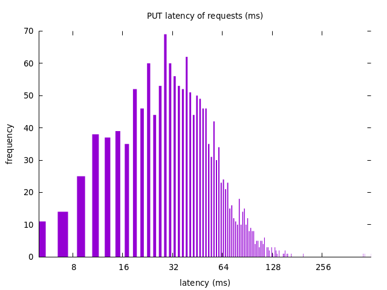

# CSC409 A2 - URL Shortener

> A lightweight scalable URL Shortener system

## Table of Contents

- [Architecture](#architecture)
  - [System Design](#system-design)
- [Running The System](#running-the-system)
  - [Initial Setup](#initial-setup)
  - [Configuration](#configuration)
  - [System Startup](#system-startup)
  - [System Shutdown](#system-shutdown)
  - [Scaling Up](#scaling-up)
  - [Scaling Down](#scaling-down)
  - [Usage](#usage)
  - [Visualizing](#visualizing)
  - [Cassandra Monitoring](#cassandra-monitoring)
- [Analysis](#analysis)
  - [System Overview](#system-overview)
  - [System Strengths](#system-strengths)
  - [System Weaknesses](#system-weaknesses)
- [Testing The System](#testing-the-system)
  - [Performance Testing](#performance-testing)
    - [Read Test](#read-test)
    - [Write Test](#write-test)

## Architecture


The following mermaid diagram architecturally describes the system, view in a markdown viewer that supports mermaid diagrams such as GitHub.

### System Design

- **URL Shortener**: The URL shortener is the main service of the system. It handles incoming requests concurrently and is responsible for handling read and write requests by checking the Redis read cache along with the Cassandra database and writing to the Redis write queue respectively. It will also write system logs and persist logs to disk.

- **Caching**: Docker and Redis are used for caching. A Docker Redis image is customized for the application and is one of the services in the swarm, acting as a read cache. The Redis service includes a single primary with persistence and multiple replicas without persistence. Data eviction is implemented to ensure Redis doesn't break under extreme load. The URL shortener server checks the Redis read cache for read requests. The read cache is updated both when the server receives a write request and on a cache miss for a read request (if the server retrieves data from Cassandra for a read request).

- **Data**: The Cassandra service is used for persisting data. The Cassandra service includes a single primary with along with multiple child nodes. Data is partitioned and replicated across the Cassandra nodes. The Cassandra nodes are deployed outside the swarm and each node saves the data to a volume external to the container for persistence.

- **Health Check**: A health check is implemented for the request handlers to ensure they are functioning correctly, configured in the Docker compose file. Monitoring for the service is done with docker visualizer, a service that provides a web interface for viewing the status of the swarm. As cassandra nodes are deployed outside the swarm, a separate monitoring service is implemented to monitor the health of the Cassandra nodes.

- **Request Handlers**: The application uses Docker and Java for handling requests. A Java server handles incoming requests. Read requests are checked for in the Redis cache. On a cache miss, the server checks the Cassandra database instead. Write requests are sent to a Redis write queue, where a separate writer application persists the requests to Cassandra.

## Running The System

### Initial Setup

> OPTIONAL: For convenience, [passwordless ssh](http://www.linuxproblem.org/art_9.html) can be setup between hosts on the VMs.

Run the `createRequiredFolders.sh` script in the scripts directory to create the required folders for the system.

### Configuration

#### URL Shortener

The service defines the configurations in the /javasrc/shortner/Dockerfile file. The configurations are as follows:

- `is_verbose`: Default true, controls whether the service should output verbose logs.
- `server_port`: Default 8000, the port that the service listens on.
- `num_threads`: Default 4, the number of threads the service should use.
- `redis_read_master_hostname`: Default read-cache-master, the hostname of the Redis read master.
- `redis_read_slave_hostname`: Default read-cache-slave, the hostname of the Redis read slave.
- `redis_write_queue_hostname`: Default write-queue, the hostname of the Redis write queue.
- `redis_read_port`: Default 6379, the port of the Redis read service.
- `redis_write_port`: Default 6379, the port of the Redis write service.
- `cassandra_hostname`: Default `10.128.1.28,10.128.2.28,10.128.3.28,10.128.4.28`, the hostnames of the Cassandra database.
- `cassandra_port`: Default 9042, the port of the Cassandra database.
- `cassandra_keyspace`: Default url_shortener, the keyspace to use in the Cassandra database.
- `cassandra_datacenter`: Default datacenter1, the datacenter of the Cassandra database.

#### Redis

Redis uses the /redis/redis.conf file for configuration.

- `maxmemory`: Default 100mb, this sets the maximum amount of memory that Redis should use. Once this limit is reached, Redis will start removing keys based on the maxmemory-policy.
- `maxmemory-policy`: Default Least Frequently Used (LFU), this determines how Redis should choose which keys to remove when the maxmemory limit is reached.
- `save 60 1`: This tells Redis to save the database to disk every 60 seconds if at least 1 key has changed. This is a way to persist data in Redis.
- `appendonly`: Default yes, Redis will use the Append Only File (AOF) persistence mode. This means that each write operation received by the server will be appended to a file. This provides a more durable way to persist data compared to just saving the database to disk periodically.

#### Cassandra

- `REPLICATION_FACTOR`: Default 2, the replication factor for cassandra can be configured in the /cassandra/startCluster script.
- `hosts`: Default 3, the number of nodes for startup can be configured in the /cassandra/hosts file.

### System Startup

To startup the service, we can use the `make` command. This will setup the swarm, build the images, and
deploy the stack.

```bash
make
```

### System Shutdown

To shutdown the service, we can use the `make kill` command. This will shutdown the swarm. Run `make kill-db` to stop the cassandra nodes.

```bash
make kill
make kill-db
```

### Scaling Up

If we want to add a node to the cassandra cluster while its running, we can run the following command to add a node with the specified host ip:

```bash
./cassandra/addNode {host ip}
```

### Scaling Down

If we want to remove a node from the cassandra cluster while its running, we can run the following command to remove a node with the specified host ip:

```bash
./cassandra/removeNode {host ip}
```

### Usage

To use the system, we can navigate to `http://localhost:8000` in a web browser. This will show the web interface for the URL shortener. Alternatively, we can use the CLI by running the following commands:

```bash
Sample PUT:
curl -X PUT "http://localhost:8000?short=arnold&long=http://google.com"

Sample GET:
curl "http://localhost:8000/arnold"
```

### Visualizing

To visualize the swarm, we can navigate to `http://localhost:8080` in a web browser. This will show the status of the swarm, including the nodes, services, and containers.

### Cassandra Monitoring

To monitor the health of the Cassandra nodes, we can use the `make monitor` command. This will start a monitoring service that will check the health of the Cassandra nodes every 5 seconds, and check the database integrity every 60 seconds.

```bash
make monitor
```

## Analysis

### System Overview

The system is a URL shortener application that leverages Docker, Redis, and Cassandra technologies.

The application is designed to be scalable and resilient, with multiple components working together to provide a robust service.

- **Load Balancing**: Docker is used to load balance the system. The ingress networking mesh allows requests to be evenly distributed across the participants of the swarm. The round robin strategy is used by default.

- **Persistence**: The application uses Docker and Cassandra for persistence. Multiple Cassandra nodes are deployed across servers, with a configurable replication factor of 2. The Cassandra nodes are deployed outside the swarm and each node saves data to a volume external to the container for persistence. Similarly, the Redis data and service logs are saved in docker volumes for persistence.

- **Scalability**: The system can be scaled horizontally through Docker and Cassandra a new node can be added to the Cassandra cluster by creating a new Docker container with a Cassandra image and connecting it to the master Cassandra node. Cassandra's gossip based protocol easily allows new nodes to be integrated with existing ones. A physical host can be added to the entire system by adding it to the swarm. New Cassandra nodes and new physical hosts are then considered by the various Cassandra and Docker services during their various operations.\
  The system can be scaled vertically through various configurations. The amount of memory used by the Redis read cache can be adjusted through configuration files, as well as the frequency of persistence. The number of threads used by the URL servers can be adjusted in the Dockerfile. These configurations allow the system to make better use of host resources if they are increased.

- **Improving Performance**: To improve performance, the server returns a response for a request immediately after each write. Writes are added to a Redis write queue and are persisted into Cassandra by a writer application. The writer application runs independently from Redis, Cassandra, and the web services.

- **Durability**: On the first host failure, no data will be lost as all of its data is partitioned around the Cassandra system. On a second host failure, minimal data will be lost since the data is partitioned and replicated within the replicas.\
  The Redis caches make use of append-only file (AoF) to persist data. This results in higher durability as this configures Redis to log all operations, which allows data to be reconstructed based on the persisted logs. The tradeoff is a slowdown in performance.

- **Recovery**: If the connection between a slave Redis read cache and the master Redis read cache is severed, the slave can later as for a re-sync.

- **Availability**: The system has high availability due to use of various replicas in the system, as well as Cassandra (which is inherently highly available). The use of master and slave Redis read caches prevents downtime from a single read cache (excluding the master) from affecting the rest of the system. The use of replicas in Cassandra allow a different node to be utilized if a node goes down, preventing a single failure from affecting the availability of the system.

- **Consistency**: Cassandra's use of eventual consistency guarantees that data across all nodes will eventually become consistent.

### System Strengths

The system is designed to be scalable and resilient, through the use of Docker, Redis, and Cassandra technologies. This is due to the nature of cassandra inquiry performances relative to the number of rows returned, and our application only returns up to a single row per request. The data is partitioned and replicated across the Cassandra nodes, which allows the system to be resilient to host failures. The system is also designed to be highly available, as the use of replicas in Cassandra and Redis allow the system to continue functioning even if a node goes down.

### System Weaknesses

One of the system's weaknesses is consistency. In order to achieve high availability, Cassandra utilizes eventual consistency. Cassandra avoids immediate updates. Instead, the data across different nodes is eventually made consistent. This prevents delays during updates and allows Cassandra to respond immediately to client requests. This can be adjusted, however, if the system requires more consistency. The consistency level can adjusted accordingly to the system's needs.

Logging could be better handled. Logs can be difficult to retrieve from the system when various components fail.

Components of the system could be better modularized. A pipeline could be setup between the various components to separate responsibilities. The logging of the system would be a good example to improve, by having the URL server send log statements to a dedicated logger container instead of handling logging itself.

## Testing The System

### Performance Testing

For performance testing, we use the performance testers used for A1 [here](https://mcs.utm.utoronto.ca/~rosenbl6/csc409/23f/assignments/a1/LoadTest.zip).

```bash
cd LoadTest
./RunLoadTest.bash
```

#### Read Test



TODO Talk about results

#### Write Test



TODO Talk about results
